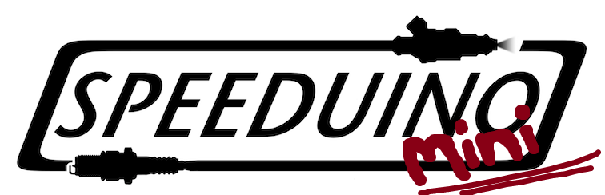

 
[]

##### A low cost, DIY friendly Engine Management System (ECU) based on the Arduino framework

## Speeduino-mini
This project is a reduced version of the Speeduino hardware - initally focused on developing a compact Speeduino for 1 and 2 cylinder motorcycles.

## License
These designs are release under the [CERN Open Hardware License v2 Strong (CERN-OHL-S)](https://ohwr.org/cern_ohl_s_v2.txt). 
This license is similar to the GPL, however is designed specifically for hardware design files, including PCB layouts and schematics. As the 'strongly reciprocal' version of the CERN OHL is used, you may use, copy, modify and create variations of these designs freely, provided that any changes or variations are also released under this CERN-OHL-S. 
